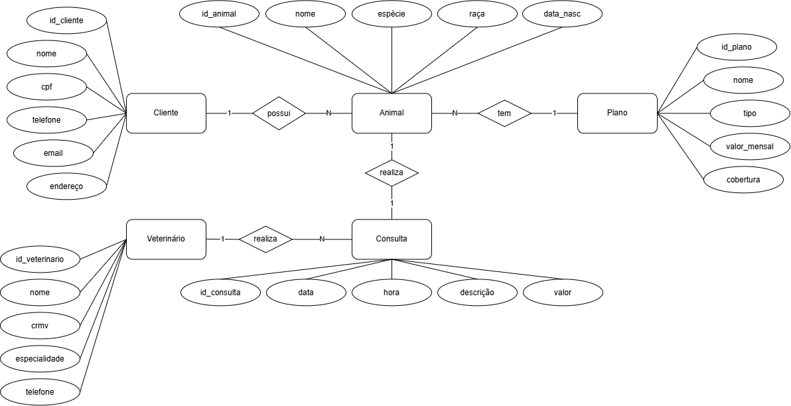
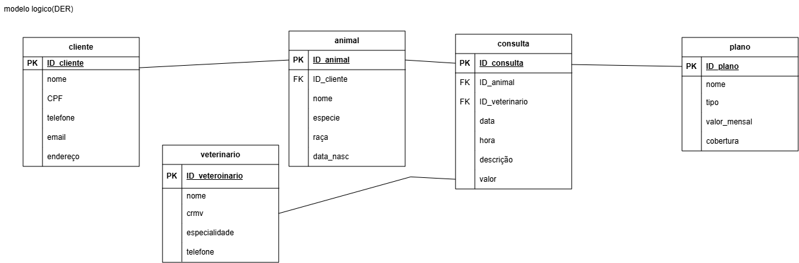

# Projeto: Plano de saude veterianrio

## Dicionário de Dados

|Entidade|Atributo|Tipo|Tamanho|Descricao|
|-|-|-|-|-|
|Cliente|id_cliente|int|11|Chave primeria do cliente|
|Cliente|nome|varchar|60|Nome completo do dono do pet|
|Cliente|cpf|varchar|14|CPF do cliente|
|Cliente|telefone|varchar|15|Telefone de contato|
|Cliente|email|varchar|80|E-mail do cliente|
|Cliente|endereco|varchar|120|Endereco do cliente|
|Animal|id_animal|int|11|Chave primaria do animal|
|Animal|id_cliente|int|11|Chave estrangeira do dono|
|Animal|id_plano|int|11|Chave estrangeira do plano|
|Animal|nome|varchar|60|Nome do animal|
|Animal|especie|varchar|30|Especie do animal|
|Animal|raca|varchar|40|Raca do animal|
|Animal|data_nasc|date|-|Data de nascimento do animal|
|Plano|id_plano|int|11|Chave primaria do plano|
|Plano|nome|varchar|60|Nome do plano|
|Plano|tipo|varchar|30|Tipo do plano|
|Plano|valor_mensal|decimal|10,2|Valor mensal do plano|
|Plano|cobertura|varchar|150|Descricao da cobertura|
|Veterinario|id_veterinario|int|11|Chave primaria do veterinario|
|Veterinario|nome|varchar|60|Nome do veterinario|
|Veterinario|crmv|varchar|20|Registro profissional CRMV|
|Veterinario|especialidade|varchar|50|Especialidade do veterinario|
|Veterinario|telefone|varchar|15|Telefone de contato|
|Consulta|id_consulta|int|11|Chave primaria da consulta|
|Consulta|id_animal|int|11|Chave estrangeira do animal|
|Consulta|id_veterinario|int|11|Chave estrangeira do veterinario|
|Consulta|data|date|-|Data da consulta|
|Consulta|hora|time|-|Horario da consulta|
|Consulta|descricao|varchar|200|Descricao da consulta|
|Consulta|valor|decimal|10,2|Valor da consulta|

## Dados de teste em CSV
- [cliente.csv](./cliente.csv)
- [consulta.csv](./consulta.csv)
- [plano.csv](./plano.csv)
- [veterinario.csv](./veterinario.csv)
- [animal.csv](./animal.csv)
